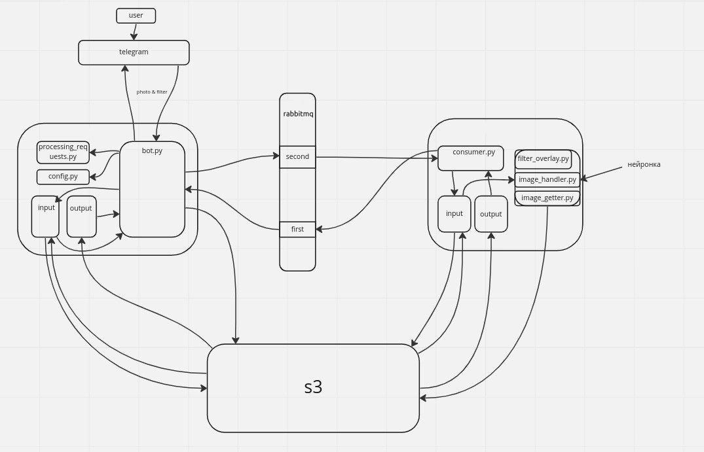

# LikeFaceAppBot
Проект был написан Павловым Иваном Дмитриевичем М8О-207Б-21 и Лютоевым Ильёй Александровичем М8О-207Б-21 в качестве курсового проекта по предменту ООП.
Этот бот накладывает фильтры на изображение лиц людей с помощью технологии компьютерного зрения. Бот был реализован с помощью библиотеки aiogram в асинхронном режиме, все Kubernetes манифесты хранятся в папке [manifests](/manifests).

## Видео-презентация проекта

## Структура проекта
- [Bot](#Bot)
- [Rabbitmq](#Rabbitmq)
- [Server](#Server)

### Бот
[bot](/bot) - telegram бот для общения с пользователем
- [app](/bot/app.py) - Запуск бота, хендлеры сообщений, связь с RabbitMQ и s3.
- [processing_requests](/bot/processing_requests.py) - Формирование запроса на очередь в несколько этапов.
- [config](/bot/config.py) - Настройки поведения бота
- [s3_handler](/bot/s3_handler.py) - Связь с Amazon AWS S3
- [state](/bot/state.py) - Состояния бота во время общения с пользователем

### Rabbitmq
[rabbitmq](/rabbitmq) - Брокер сообщений
- [config](/rabbitmq/advanced.config) Настройки для RabbitMQ

### Сервер
[server](/server) - Сервер, работающий в режиме потребителя и генерирующий описания
- [server](server/server.py) - Общение с RabbitMQ со стороны сервера
- [image_getter](server/image_getter.py) - Получение ключевых точек лица с помощью технологий CV
- [image_handler](server/image_handler.py) - Наложение фильтра на картинки
- [filter-overlay](server/filter-overlay.py) - Связь модели и сервера

### Архитектура 

### Запуск через docker compose
Установить для бота токен и пароль для redis, в файле docker-compose
`docker-compose -f docker-compose.yml up --build`

### Запуск через kubernetes

Запуск всех манифестов

`kubectl apply -f "https://github.com/rabbitmq/cluster-operator/releases/latest/download/cluster-operator.yml"`
`kubectl apply -f "/manifests"`

